# aupy: AUPE Reflectance and Colour Calibration in Python

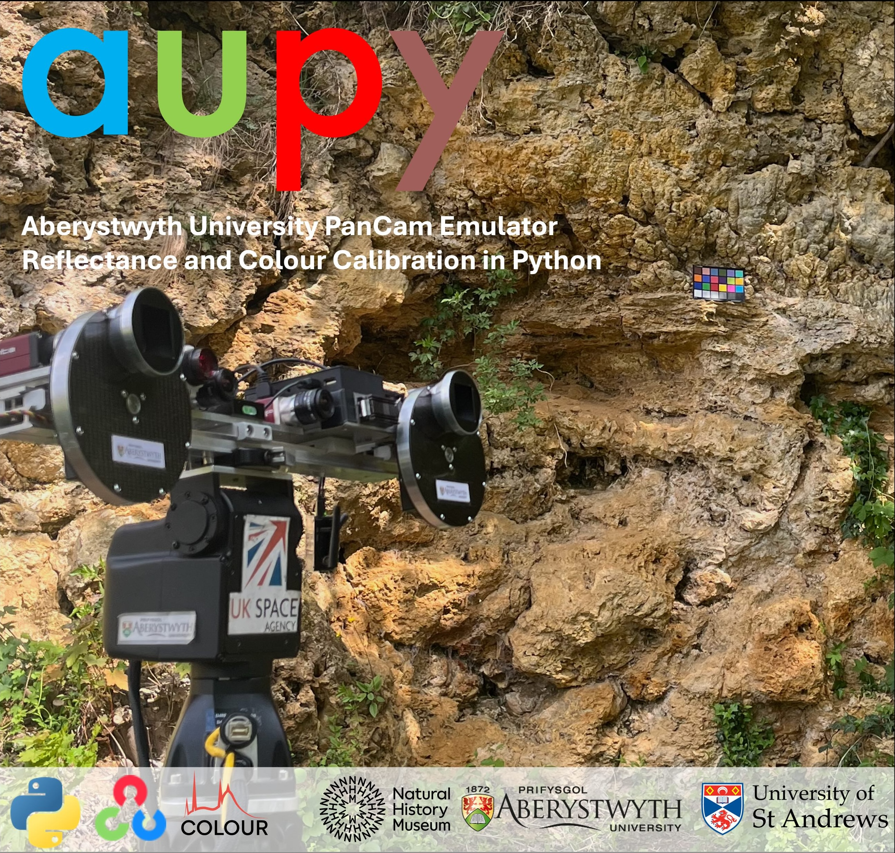

## Update - PanCam TM Branch 1/10/2025 <a name = "update"></a>

This branch extends aupy to handle data from the PanCam Training Model (TM).

The functionality is the same as below, but the code and directory structures have been generalised to handle the two different camera systems, AUPE and the PanCam TM, and also the PanCam Calibration Target, that will be used during the ExoMars mission that this work is in preparation for.

## About <a name = "about"></a>

This is a Python toolkit for processing AUPE ([Aberystwyth University PanCam Emulator](https://exomars.wales/facilities/aupe/)) images into colour and reflectance products, through calibration against in-scene images of the MacBeth/Gretag/ColorRite Colour Checker 24-patch colour calibration target.

Raw 8-bit png files, output by AUPE, are read and processed into reflectance units, and collected into multispectral cubes and exported to ENVI hdr/img format files, for analysis via standard spectral imaging software (e.g. [ENVI](https://www.nv5geospatialsoftware.com/docs/ProgrammingGuideIntroduction.html), [SpectralPython](https://www.spectralpython.net/), [WISER](https://ehlmann.caltech.edu/wiser/index.html)), or via the bespoke PanCam Operations Toolkit, [PCOT](https://pcot.aber.ac.uk/).

The toolkit uses the Python [OpenCV](https://docs.opencv.org/4.x/d6/d00/tutorial_py_root.html) and [Colour Science](https://www.colour-science.org/) libraries to assist with colour processing and image processing functions.

## Installation and Setup <a name = "setup"></a>

These instructions will get you a copy of the project up and running on your computer.

This guide has been written with an assumption of no prior experience with github or installing python libraries.

### Prerequisites

#### Code Editor
If you're new to code editing, I recommend using VisualStudioCode to edit and run your Python notebooks and libraries. You can install it here:
[VisualStudioCode](https://code.visualstudio.com/).

#### Downloading aupy
Next, we need to download this github repository, that contains the codebase (aupy.py), the template notebooks for performing processing tasks, and a set of various calibration files that are needed to perform calibration.

Setup a new folder on your computer for your AUPE processing project.

If you are new to github and coding, you can just download a copy of this as a zip file.

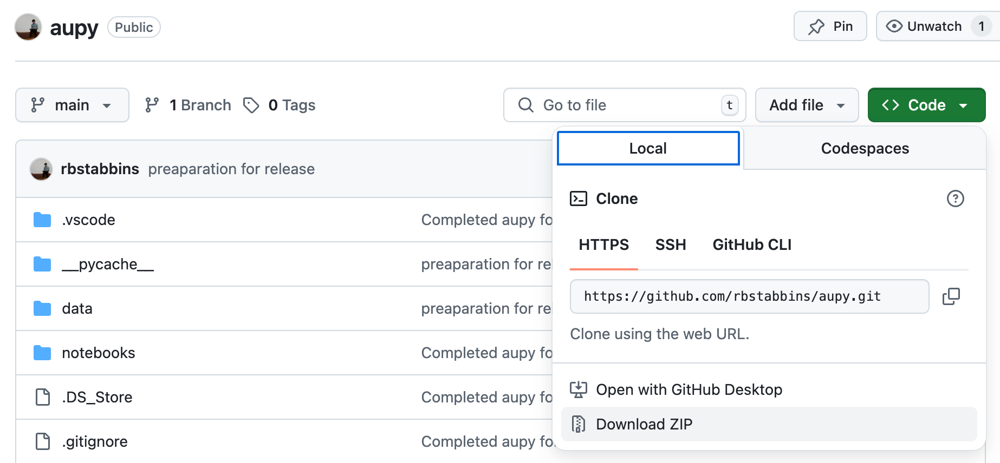

If you are comfortable with git repositories, feel free to clone this repository to stay up-to-date with developments and bug-fixes.

Unzip this into your project folder.

#### Environment Setup

Now we will get the code running.

Open VSCode, and when prompted to open a folder, navigate to the aupy repository you just unzipped. This sets up VSCode to work with this repository.

We now need to setup a virtual environment for running the code in. In the repository there is an `environment.yml` file that gives a list of dependencies that need to be installed to run this code.

We use ```conda``` to setup and manage this virtual environment.

You can install ```miniconda``` to do this here: [Conda](https://www.anaconda.com/docs/getting-started/miniconda/install)

In VSCode, navigate to the terminal at the bottom of the window. We will use the terminal to setup this environment.

First, we can check quickly that we are indeed in the correct directory, by running ```pwd```:

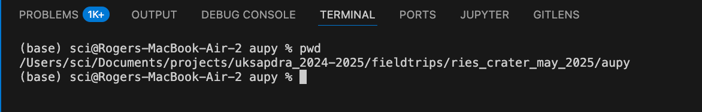

This should print the path to the directory of this repository. [If you're having trouble navigating your folders in the terminal this might help](https://gomakethings.com/navigating-the-file-system-with-terminal/).

Check that conda has installed by typing ```conda -V```. This should print the version number. If instead it says something like ```command not found: conda```, then try installing miniconda again, and troubleshoot using the conda website.

We can now setup the virtual environment, by running

```
conda env create --name aupy --file environment.yml
```

This will install a clean Python distribution, as well as the Python libraries needed to run aupy.py.

## Usage <a name = "usage"></a>

The ```ries_scene_complete_template.ipynb``` provides a template for processing AUPE scenes. This notebook, and this toolkit, have been developed for processing data captured during the Canadian Space Agency x UK Space Agency field trip to the Ries Crater, May 2025.

To run this notebook and process the data, the raw data from the field trip needs to be downloaded and put in a repository called ```data``` in the project folder, next to the aupy repository.

```
project
├── aupy
│  ├── aupy.py
│  ├── data
│  │  ├── aupe_info.csv
│  │  └── ...
├── data
│  ├── SOL1
│  ├── SOL2
│  │  ├── sol2_0
│  │  │  ├── Trial1
│  │  │  │  └── ...
├── processed
│  ├── SOL1
│  ├── SOL2
│  │  ├── sol2_0
│  │  │  ├── Trial1
│  │  │  │  └── ...
```

The notebook is setup to demonstrate processing of scene SOL2/sol2_8.

When you open the notebook, you should be prompted to select a kernel for the notebook. Navigate to Python Environments, and you should see an option called 'aupy (Python 3.13.x...)'. Choose this kernel. If this isn't visible, try restarting Visual Studio Code - it may not have registered that you have setup your new conda environment.

Please follow through the notebook, running it on your computer, to understand the steps of processing, and how the aupy library is called and used.

Processed data is exported to a structured directory at ```processed```.

## Overview of Processing

Here is an overview of a typical processing routine, as shown in the template notebook.

For code snippets for producing these figures, please find the corresponding figures in the `ries_scene_complete_template.ipynb` notebook.

The key parts are:
1. LWAC Processing
   1. RGB Approx. Processing
   2. RGB Reflectance & Colour Calibration
   3. Geology Reflectance Calibration
2. RWAC Processing
   1. RGB Approx. Processing
   2. RGB Reflectance & Colour Calibration
   3. Geology Reflectance Calibration
3. LWAC->RWAC Rectification
   1. Choose common feature to find optimal warp for feature distance
   2. Warp LWAC->RWAC to give LRWAC 12-band Cube from RWAC View
4. HRC Processing
   1. RGB Approx. Processing
   2. Reflectance transfer from RWAC Reflectance Calibration
5. RWAC->HRC Rectification
   1. Choose common feature to find optimal warp for distance
   2. Warp LRWAC 12-band Cube to HRC View

### LWAC Processing
   #### RGB Approx. Processing
   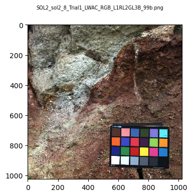|
   :-------------------------:|
   |99th Percentile Band Stretch LWAC RGB Example|

   We've implemented several simple methods that give quick colour stretches. This gives a quick look at the colour image, and always produces a usable image, regardless of overexposure or presence of a calibration target. The '99b' method stretches each band independently, such that the 99th percentile pixel level is stretched to the maximum brightness value of the image (e.g. 1 in normalised units, or 255 in an 8-bit image).  
   #### RGB Reflectance & Colour Calibration
   Reflectance and colour calibration is performed by finding the mixing matrices and balance vectors that map the colours and spectra of the patches of a 24-patch Colour Checker to the reference values. Reference patch colours are looked-up in the Colour Science library, and patch reflectance spectra have been measured using an RS350 spectrometer from 350 - 2500 nm, at 1 nm intervals, and then resampled with the transmission profiles of each filter of AUPE. Each transmission profile is the linear mixture of the filter transmission, lens transmission, and quantum efficiency of the Manta G-504 cameras used.

   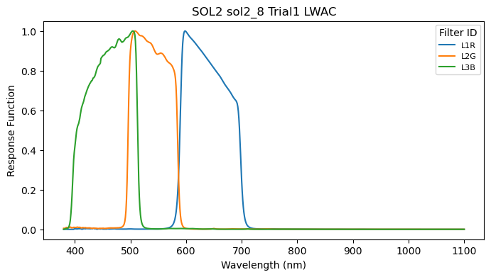|
   :---------------------------------------:|
   |LWAC RGB Transmission Profiles|

   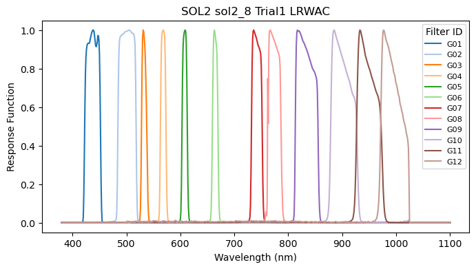|
   :---------------------------------------:|
   |L+RWAC Narrowband Transmission Profiles|

   The colour checker patches are found in a scene either by running the Colour Science Colour Checker Detection algorithm, or if that fails, by manually drawing around the target using the PolyROI library.

   Given an outline of the Colour Checker, the Colour Science library handles extraction of patch values over sub-patch regions of interest (ROIs). 
   
   For colour calibration, the mean patch value of each of the Red, Green and Blue channels is used. If a patch is overexposed in any of these channels, the entire patch is discarded from the Colour Correction Matrix fitting routine, because the output colour channel is a weighted mixture of each of the input colour channels. 
   
   For reflectance calibration, a Gaussian is fitted to the distribution of pixels within each ROI. This handles cases where the ROI drifts off the patch and covers some of the target border. Overexposed patches are discarded only in the band for which they are overexposed. This is because reflectance correction coefficients are fitted for each band independently.

   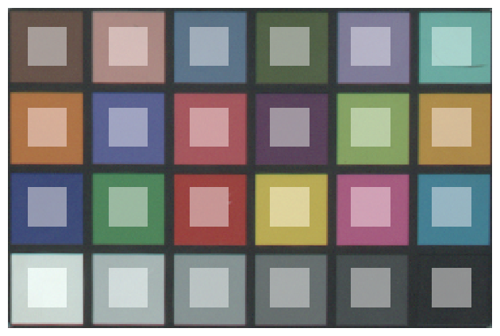|
   :---------------------------------------:|
   |Automatically found Regions of Interest of the Colour Checker patches|

   Prior to calibration, all images are corrected for exposure, converting to units of DN/s. This handles the different exposure times used for each WAC filter, putting each channel into a common unit.

   For RGB Colour calibration, we first find the reflectance correction coefficients for each patch. You can see in this example, all patches fall on a straight line when plotted against their reference reflectance value in each channel.

   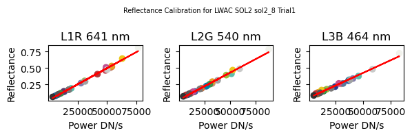|
   :---------------------------------------:|
   |Reflectance Coefficient linear fits between the exposure corrected image data and reference reflectance values.|

   We can check how well our reflectance coefficients fit by plotting the reference spectrum against the fitted spectrum for each patch.
   
   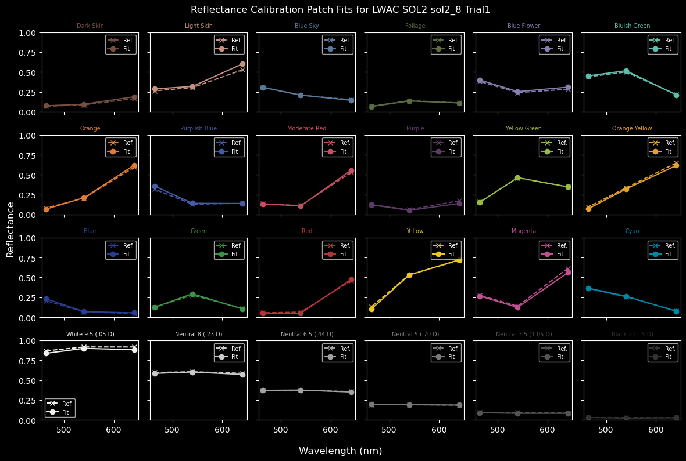|
   :---------------------------------------:|
   |Reference vs. Fitted patch spectra after RGB reflectance calibration.|

   **Mathematical Description**

   It can be useful to express these steps mathematically.

   Given a patch $p$ in the set of $n_p$ patches $P$, with continuous reflectance spectrum $R_p(\lambda)$, then the reference reflectance of $p$ when sampled by the filter $f$ in the set of $n_f$ filters $F$, with continuous transmission spectrum $T_f(\lambda)$, is:

   $$R_{ref}[f,p] = \frac{\int_{\lambda} R_p(\lambda) T_f(\lambda) d\lambda}{\int_{\lambda} T_f(\lambda) d\lambda}$$

   giving us an $n_f \times n_p$ matrix $\mathbf{R}_{ref}$.

   Given an image $\bold{S}[f]$ through filter $f$ with units of DN, let the subset of pixels $\mathbf{i}_p$ (where $\mathbf{i} = (i,j)$) be the pixels that represent the patch $p$ in $\mathbf{S}_f$. Let $\mathbf{S_e}[f] = \mathbf{S}[f] / t_{exp}[f]$ be the exposure corrected image in units of DN/s.
   
   Let the function $h({S_e}[f,\mathbf{i}_p])$ give the histogram of ${S_e}$ over $\mathbf{i}_p$. We define the average value of ${S_e}[f,p] \forall \mathbf{i} \in \mathbf{i}_p$ as the solution of the Levenberg-Marquardt nonlinear least-squares optimisation problem,

   $$(\hat\mu, \hat\sigma) = \underset{\mu,\sigma}{\operatorname{\argmin}}|h({S_e}[f,\bold{i}_p]) - g(S_e|\mu, \sigma)|^2$$

   as implemented in the `curve_fit` method of SciPy, where $g(S_e|\mu, \sigma)$ is the Gaussian function

   $$g(S_e|\mu, \sigma) = \frac{1}{\sigma\sqrt{2\pi}} \exp \left( -\frac{(S_e - \mu)^2}{2\sigma^2} \right)$$

   This gives the mean value of each $p\in P$ and each $f\in F$, to give the matrix $\hat S_e[f,p]$.

   For each $f \in F$, we find the line 

   $$\hat R_{ref}[f,:] = r_m[f] \hat S_e[f,:] + r_c[f]$$

   $\forall \;p \in P$.

   by solving the linear least-squares optimisation problem for (r_m, r_c)

   $$(r_m, r_c) = \underset{r_m, r_c}{\operatorname{\argmin}}\sum_{p\in P}|R_{ref}[p] - (r_m[f] \hat S_e[p] + r_c)|^2$$ 

   Note that from this formulation, it's just a few steps more to implement uncertainty propagation through these fitting routines. This is on the To Do list for aupy.

   For colour calibration, we take the subset of filters $f_{rgb}=(R,G,B) \in F$, and find the matrix $\mathbf{M}_{ccm}$ that maps $\hat R_{ref}[f_{rgb},p]$ to the $\text{sRGB}[f_{rgb},p]$ colour values of $p$, that are standardised for the Colour Checker target, and provided in the Colour Science library.

   We solve the linear problem

   $$\begin{bmatrix}\text{sRGB}[R,p]\\\text{sRGB}[G,p]\\\text{sRGB}[B,p]\end{bmatrix} = \begin{bmatrix}a&b&c\\d&e&f\\g&h&i\end{bmatrix} \begin{bmatrix}\hat R_{ref}[R,p]\\\hat R_{ref}[G,p]\\\hat R_{ref}[B,p]\end{bmatrix}$$

   by inverting $\mathbf{M}_{ccm}$, via the polynomial method of [Cheung et al 2004](https://www.researchgate.net/publication/227522365_A_comparative_study_of_the_characterisation_of_color_cameras_by_means_of_neural_networks_and_polynomial_transforms).

   After conversion to $\text{sRGB}$, we then apply the standard Gamma2.2 nonlinear encoding to the colour images.

   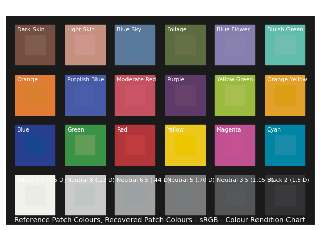|
   :---------------------------------------:|
   |Reference vs. Fitted patch spectra after RGB reflectance calibration.|

   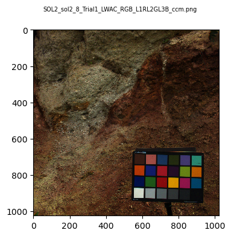
   #### Geology Reflectance Calibration
   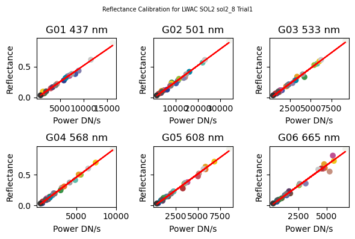
   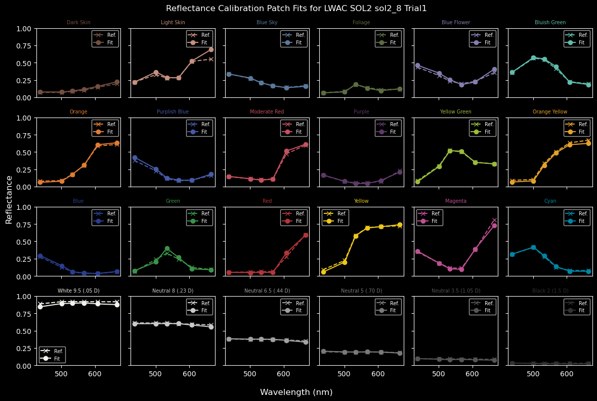
   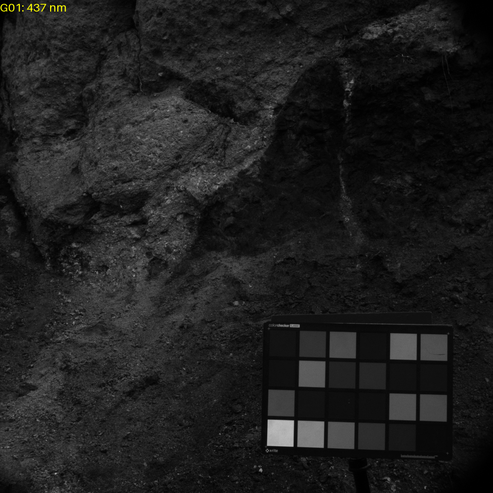
### RWAC Processing
   #### RGB Approx. Processing
   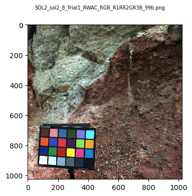
   #### RGB Reflectance & Colour Calibration
   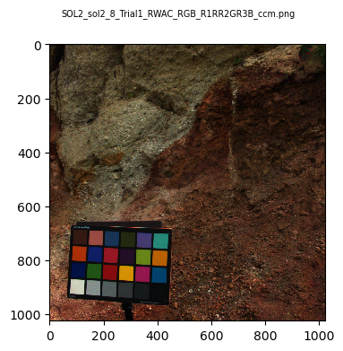
   #### Geology Reflectance Calibration
   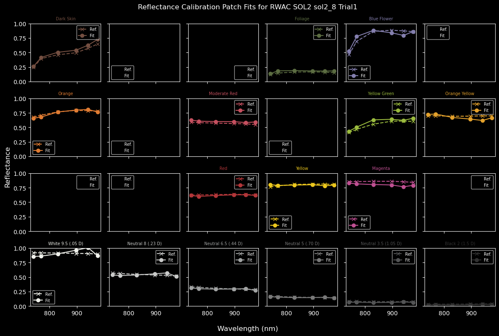
   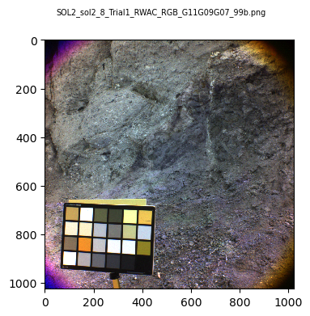
### LWAC->RWAC Rectification
   #### Choose common feature to find optimal warp for feature distance
   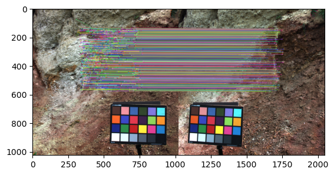
   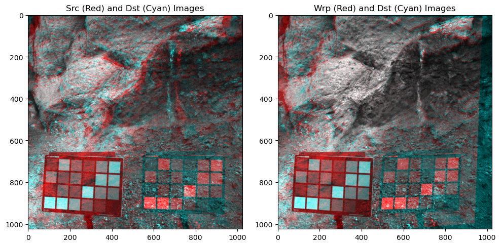
   #### Warp LWAC->RWAC to give LRWAC 12-band Cube from RWAC View
   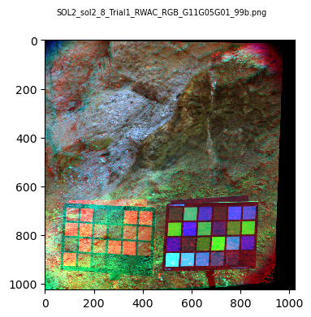
   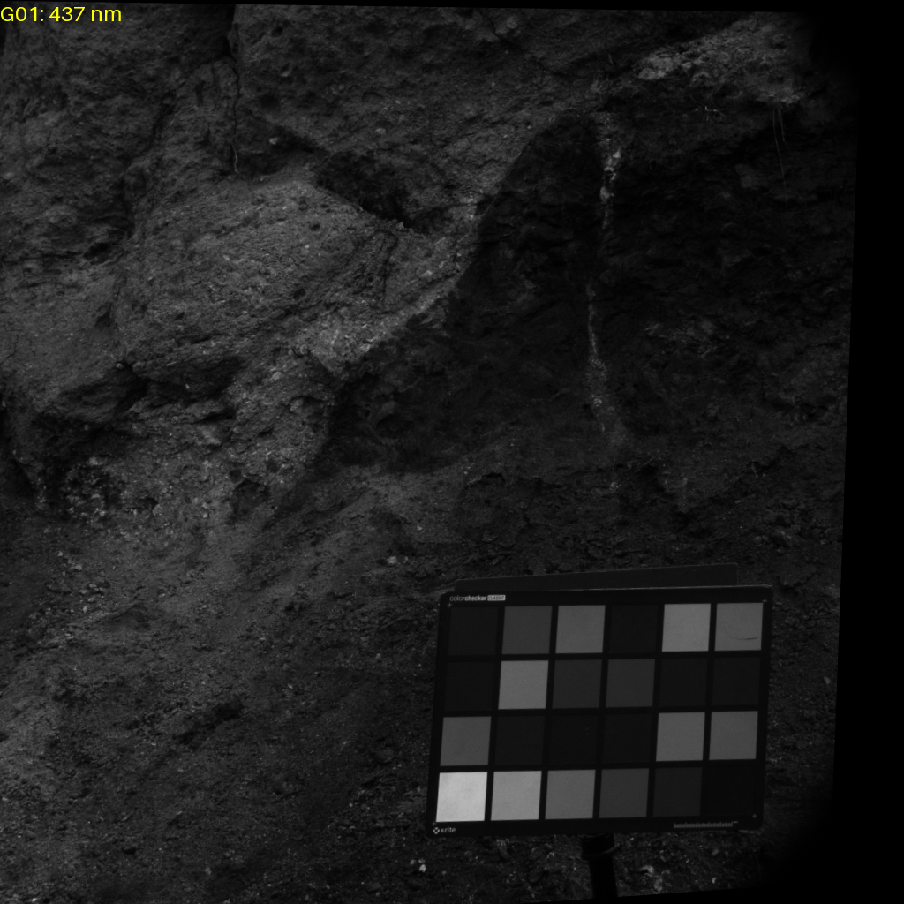
### HRC Processing
   #### RGB Approx. Processing
   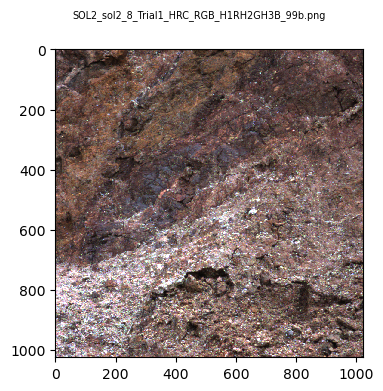
   #### Reflectance and Colour transfer from RWAC Reflectance Calibration
   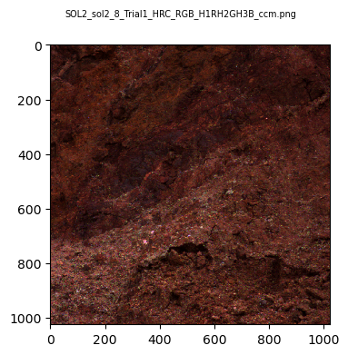
### RWAC->HRC Rectification
   #### Choose common feature to find optimal warp for distance
   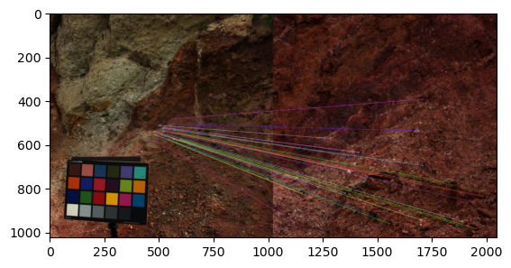
   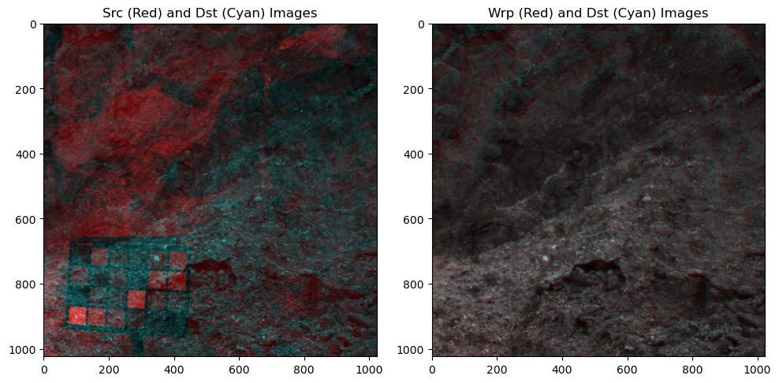
   #### Warp LRWAC 12-band Cube to HRC View
   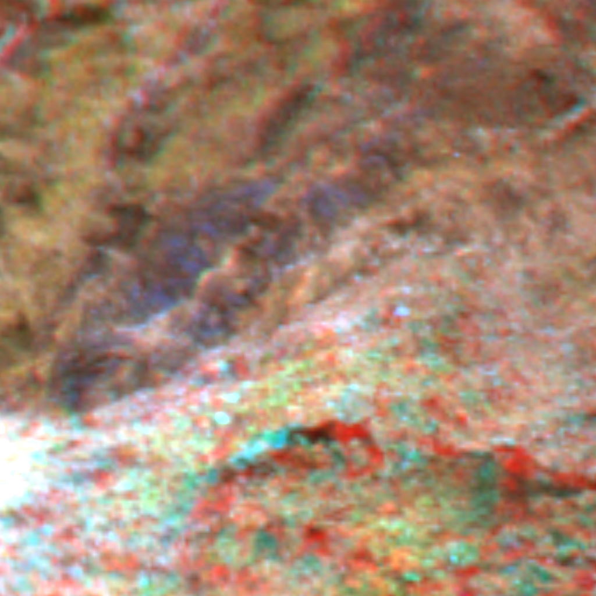
    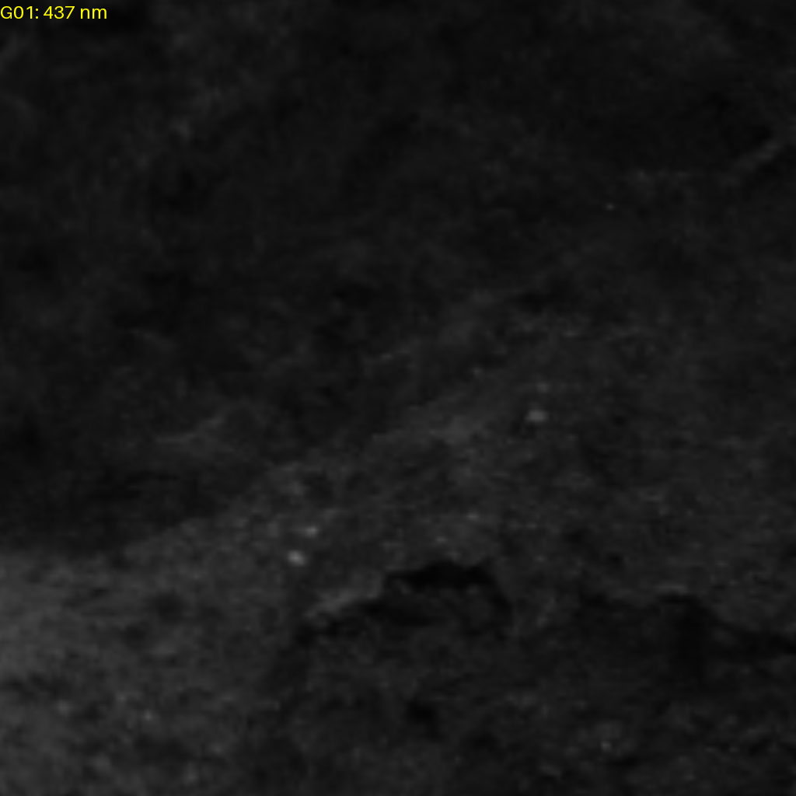

## Author

This library has been developed by Roger Stabbins at the Natural History Museum, London, UK, since May 2025.