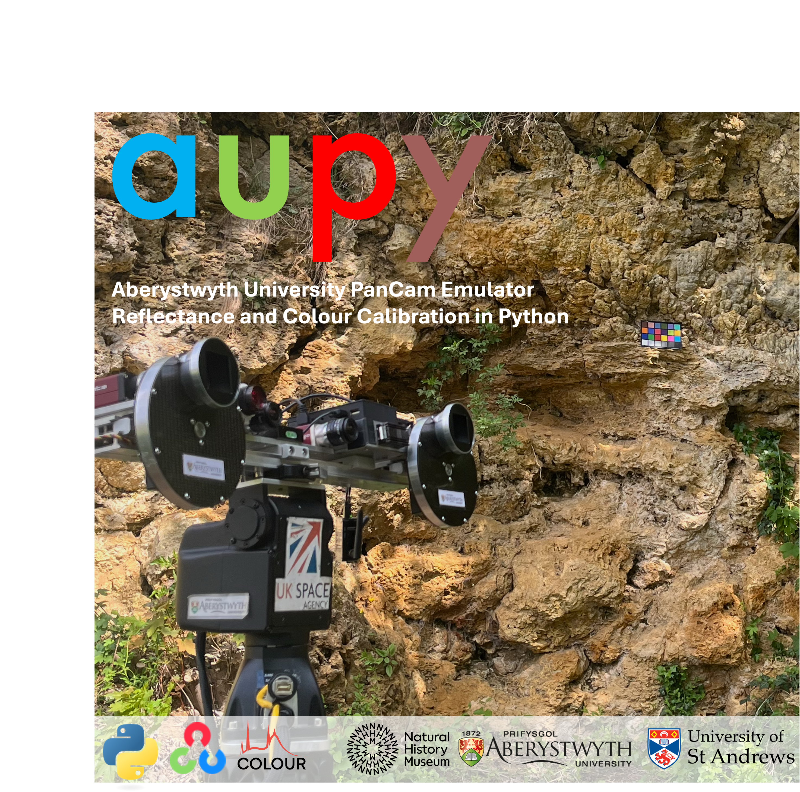

# aupy: AUPE Reflectance and Colour Calibration in Python



## About <a name = "about"></a>

This is a Python toolkit for processing AUPE ([Aberystwyth University PanCam Emulator](https://exomars.wales/facilities/aupe/)) images into colour and reflectance products, through calibration against in-scene images of the MacBeth/Gretag/ColorRite Colour Checker 24-patch colour calibration target.

Raw 8-bit png files, output by AUPE, are read and processed into reflectance units, and collected into multispectral cubes and exported to ENVI hdr/img format files, for analysis via standard spectral imaging software (e.g. [ENVI](https://www.nv5geospatialsoftware.com/docs/ProgrammingGuideIntroduction.html), [SpectralPython](https://www.spectralpython.net/), [WISER](https://ehlmann.caltech.edu/wiser/index.html)).

The toolkit uses the Python [OpenCV](https://docs.opencv.org/4.x/d6/d00/tutorial_py_root.html) and [Colour Science](https://www.colour-science.org/) libraries to assist with colour processing and image processing functions.

## Getting Started <a name = "getting_started"></a>

These instructions will get you a copy of the project up and running on your computer.

This guide has been written with an assumption of no prior experience with github or installing python libraries.

### Prerequisites

#### Code Editor
If you're new to code editing, I recommend using VisualStudioCode to edit and run your Python notebooks and libraries. You can install it here:
[VisualStudioCode](https://code.visualstudio.com/).

#### Downloading aupy
Next, we need to download this github repository, that contains the codebase (aupy.py), the template notebooks for performing processing tasks, and a set of various calibration files that are need to perform calibration.

Setup a new folder on your computer for your AUPE processing project.

If you are new to github and coding, you can just download a copy of this as a zip file.


If you are comfortable with git repositories, feel free to clone this repository to stay up-to-date with developments and bug-fixes.

Unzip this into your project folder.

#### Environment Setup

Conda: https://www.anaconda.com/docs/getting-started/miniconda/install

```
Give examples
```

### Installing

A step by step series of examples that tell you how to get a development env running.

Say what the step will be

```
Give the example
```

And repeat

```
until finished
```

End with an example of getting some data out of the system or using it for a little demo.

## Usage <a name = "usage"></a>

Add notes about how to use the system.

## Author

This library has been developed by Roger Stabbins at the Natural History Museum, London, UK, since May 2025.